# IT Architecture Management — Exam Study Guide
**Course:** IT Architecture Management, Summer Semester 2026 · Prof. Thomas Widjaja, Uni Passau
**Based on:** Lectures 1–11 + Tutorials 5–7 (Modules 1, 2, 3, [4], 5, [6])
**Format:** Written exam, open questions

---

## How to use this guide

Every content block in the lecture slides is preceded by a **"Learning Objectives: Students … define / explain / distinguish / delineate / apply …"** box. That phrasing *is* the exam blueprint — professors who write objectives this explicitly tend to draw open questions almost verbatim from them. This guide is organized so that:

- Each subsection opens with the **learning objectives** as a checklist.
- Definitions are given **exactly as cited** (author, year) — in open-question exams, naming the source (e.g. *"according to Ross 2003…"*) often earns extra points.
- Diagrams you can't easily reproduce in a written exam are described in **words**, precisely enough that you could redraw or narrate them.
- Each module ends with a **practice open-question set** with model-answer bullet points.
- A **command-word key** and **master citation table** are at the end — great for last-minute review.

### Command words — what the exam actually wants
| Word | What to actually write |
|---|---|
| **Define** | The precise definition, ideally with author/year |
| **Explain** | Definition + *why/how* it works, in your own words, maybe an example |
| **Distinguish / Differentiate** | Two (or more) definitions placed side by side + the *one key difference* |
| **Delineate** | Draw the boundary — what's included vs excluded, or list components |
| **Apply** | Take the abstract model and map it onto a concrete case/example |
| **Relate / Connect** | State the mechanism that links concept A to concept B |

---

## MODULE 1 — Introduction and Overview

### 1.1 Information Systems and Systems Theory

**Learning objectives:** define architecture; explain why IT architectures are a special type of architecture; define/explain "system"; define information systems as a special type of system; explain levels of abstraction; delineate an Information System as a sub-system of the enterprise.

**Architecture (general)**
> "An architecture describes the basic structure of a system with its elements, the relationships between these elements, and the relationships of the system to the environment. In addition, principles for the construction, further development and use of the system should also be described." — **IEEE 2000**

**IT Architecture**
> "The organizing logic for applications, data, and infrastructure technologies, as captured in a set of policies and technical choices, intended to enable the firm's business strategy." — **Ross 2003, p. 31**

*Why is an IT architecture a "special" architecture?* Because it isn't just physical structure — it explicitly ties structure to an **enabling purpose** (the firm's strategy) and encodes it as **policies/technical choices**, not just a blueprint.

**System**
> "A system is a group of components that are related to each other."
Examples: information system, health care system, school system, ecosystem.

**Information System** (socio-technical!)
> "ICS [information and communication systems] are socio-technical systems that include human and machine components (subsystems) that are interdependent, interrelated, and/or interact with each other." — **König 1994, p. 80**

Structure (memorize this stack — it's the "Mensch/Human" diagram):
- **Human** (Mensch)
- **Application Software** → together with Foundational Software = **Software system**
- **Foundational Software** (Basissoftware)
- **Computer/Hardware** → **Hardware system**
- Application System = Application Software + Hardware running it
- **Information System** = Human + Application System + further technical facilities, connected by **Relations** (e.g., exchange of information)

**Relations in systems** — two types:
1. **"Interacts with" relations** — material flows, information flows, energy flows (need not be visible)
2. **"Consists of" relations** — structural composition

**Levels of abstraction:** A system is described at a chosen level of abstraction: its **components** (e.g. computers, applications, databases, people) and its **relations** (e.g. exchange of information) can be zoomed in/out.

**Closed vs. Open systems:** An open system has a boundary across which it exchanges with **environmental components**; the **system boundary** separates system from environment.

**Boundaries of a system** are **arbitrary**:
- Problem: what belongs to the system (vs. environment) depends on the observer's *knowledge* and *objective/perspective*.
- **Principle of "prevalence of internal connectivity":** modelers should draw boundaries so that components *inside* are more connected to each other than to components *outside* (in the environment).

**Static vs. Dynamic systems:** In **static** systems, attributes of components/relations stay constant over time (e.g. a theoretical classification system); in **dynamic** systems, they change.

**Super-system, Sub-system, System segment:**
- **Super-system** = the surrounding system (e.g., a Group containing Company A and Company B)
- **Sub-system** = a component of another system (e.g., "MM" and "QS" departments inside the Information System of Company A)
- **System segment** = a focus on certain properties (e.g., the "Information system" segment cutting across Company A)

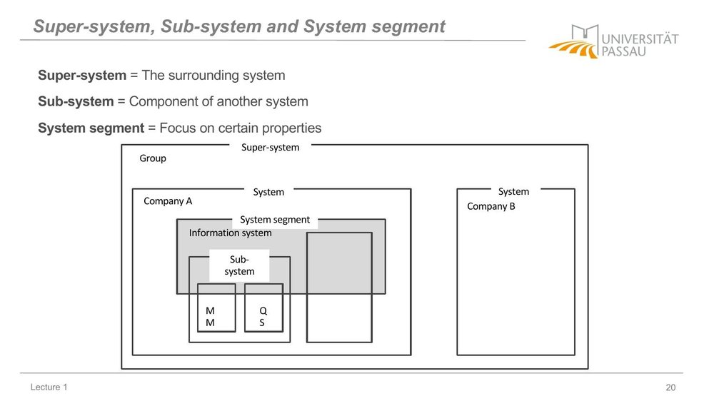

**Information System as a sub-system of an Enterprise** (Suchan & Frank 2012 matrix): classifies the enterprise by
- **Task object**: *Information* (Information System) vs. *non-information* (Base System)
- **Task carrier**: *not automated* (Manager/Consultant/Data Acquisition = human) vs. *automated* (Application Systems)
- **Task phase**: *Control System* (planning, decision, control) vs. *Performance system* (implementation/execution)

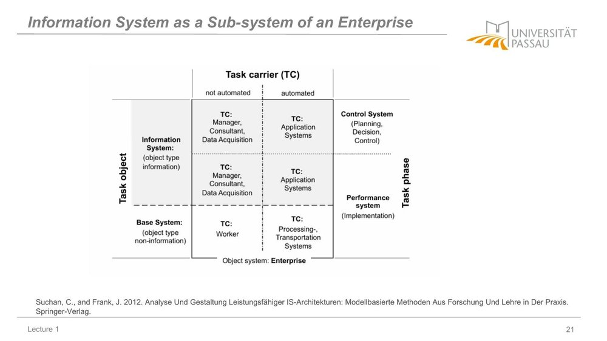

**Three perspectives on a system:**
| Perspective | Question | Focus | Concepts |
|---|---|---|---|
| **Structural** | What components does it consist of? How can it be resolved? | Composition | Levels of abstraction, super/sub-system |
| **Functional** | What is the purpose? What does it do? | Behavior at the boundary | Black-box, input & output |
| **Behavioral** | How does it work? Which mechanisms cause its behavior? | Internal mechanism | White-box, components & relationships |

---

### 1.2 Foundations of the Management of IT Architectures

**Learning objectives:** explain why IT architectures are a special type of architecture; delineate IT architecture vs. enterprise architecture; explain the tasks of IT architecture management and their relevance; explain and apply the EABM.

**Enterprise Architecture (EA) vs. IT Architecture** — nested relationship:
- **Enterprise Architecture** = **Business Process Architecture** ⇄ (via **IT requirements** ↓ / **IT capabilities** ↑) ⇄ **IT Architecture**
- **IT Architecture** (the inner box) = **Data/Information Architecture** + **Application Architecture** + **Infrastructure Architecture** (Data/Info and Application connect to each other; both connect down to Infrastructure)

So: Business drives IT via *requirements*; IT enables business via *capabilities*. IT Architecture is a **sub-set** of Enterprise Architecture focused on the technology side.

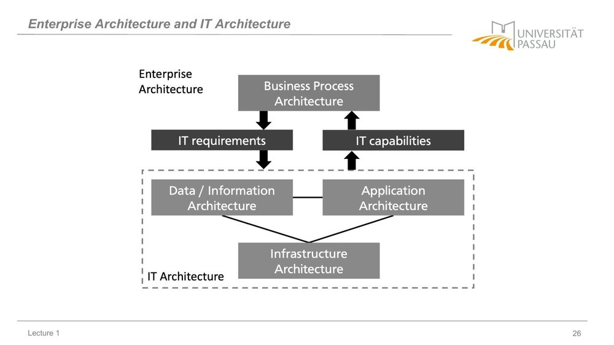

**EAM as a "Bridge" between Business and IT:** EAM outlines fundamental **organizational structures** on one side and defines essential **IT structures** on the other, and — as the bridge — highlights the **interrelationships and dependencies** between them (e.g., which information systems support which business processes).

**Enterprise Architecture Benefits Model (EABM)** — **Tamm, Seddon, Shanks & Reynolds 2011** — *the* central model of Module 1. Memorize the causal chain:

```
Enterprise Architecture Quality
        │ (+)
        ▼
  ┌─────────────┬──────────────┬───────────────────────┬────────────────────┐
  │Organizational│ Information  │ Resource Portfolio     │ Resource            │
  │ Alignment    │ Availability │ Optimization           │ Complementarity     │
  └─────────────┴──────────────┴───────────────────────┴────────────────────┘
        all four are "benefit enablers", all (+) into:
                       Organizational Benefits
```
All relationships in the model are drawn as **positive (+)** — EA Quality positively affects all four enablers, and all four enablers positively affect Organizational Benefits (some enablers also reinforce each other).

**Construct definitions (learn these verbatim — high exam-value):**
| Construct | Definition (Tamm et al. 2011) |
|---|---|
| **Enterprise Architecture (Quality)** | "The definition and representation of a high-level view of an enterprise's business processes and IT systems, their interrelationships, and the extent to which these processes and systems are shared by different parts of the enterprise." A *high-quality* EA provides a vision for the future operating platform aligned with strategic goals, plus an optimal roadmap based on an accurate understanding of the current platform. |
| **Organizational Alignment** | The extent to which subunits share a common understanding of strategic goals and contribute toward achieving them. |
| **Information Availability** | The extent of useful, high-quality information accessible to decision makers. |
| **Resource Portfolio Optimization** | The extent to which the organization leverages existing resources, invests to target performance gaps, and minimizes unnecessary duplicated investments. |
| **Resource Complementarity** | The extent to which resources synergistically support the pursuit of strategic goals. |
| **Organizational Benefits** | Outcomes contributing directly to performance: lower costs, higher revenue, competitive differentiation, more accurate decisions, strategic agility, etc. |

**Resource Portfolio Optimization vs. Resource Complementarity — the classic "distinguish" question:**
- **Shared:** both rely on organization-wide analysis/identification of resources & their interdependencies; both benefit from reducing overlaps via **componentization**.
- **Key difference:** RPO focuses on **reducing redundancy** (duplication/overlap) and improving resource **quality** → this is **component innovation** (introducing superior components). RC focuses on **leveraging synergies**, combining resources in ways that boost performance and are **hard for competitors to replicate** → this is **architectural innovation** (reconfiguring components). That's why the EABM treats them as two *distinct* benefit enablers.

---

### 1.3 IT Architectures as Models

**Learning objectives:** explain "model" based on general systems theory; understand the function and delineate the components of a meta-model.

**Model (definition):** "A model is a system that represents another system in a **goal-oriented** manner." (from Italian *modello* = pattern/example)

A model is a **3-tuple (S, S_M, f)**:
- **S** = object system (the system being "mapped")
- **S_M** = model system (the "image" of the object system)
- **f** = function (the mapping between object system and model system)

**Modeling** = the activity of creating a model:
1. Determine the model's specific purpose
2. Select the modeling methodology and model function
3. Define the boundaries of the object system
4. Construct the model system

Central to modeling is **similarity** between object and model system: **structural**, **functional**, and **behavioral** similarity (mirrors the 3 system perspectives from 1.1!). Two requirements for good models:
- **Abstraction** (omission of details)
- **Accuracy** (in mapping the relevant features)

**Token Modeling vs. Type Modeling** — a classic distinguish question:
- **Token modeling:** each individual object (token) in the object system maps to its own individual element in the model system → a **1:1** mapping of *instances*.
- **Type modeling:** many individual objects of the *same kind* (type/class) in the object system map onto **one** shared model element → a **many:1** mapping, abstracting over categories rather than instances.

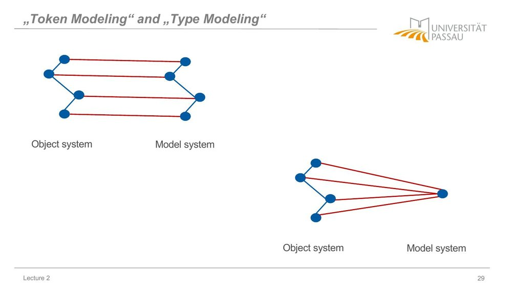

**Current Architecture vs. Target Architecture:** Models are also classified by their time-reference — the "as-is" (current) state of the IS/IT architecture vs. the "to-be" (target) state envisioned for the future.

**Meta-Model:** "If models and model construction themselves become the object of modeling, we speak of meta-models."
> A meta-model defines: (1) the **types of model components**, (2) the **types of relationships** between model components, (3) the **rules for linking** model elements by relationships, and (4) the **meaning (semantics)** of the model components and relationships. — **Ferstl & Sinz 2013, p. 137**

(Relationship of model ↔ meta-model = an *instantiation* relationship — this is explicitly **different** from the reference-model relationship in Module 3, which sits at the *same* abstraction level. Don't mix these up!)

**Software support example:** ARIS — a tool supporting business-process modeling for enterprise/business architects.

---

### Module 1 — Practice Open Questions

1. **Define** the term "IT architecture" and explain why it counts as a special type of architecture. *(→ IEEE 2000 general def. + Ross 2003 IT-specific def.; special because it explicitly serves to enable business strategy via policies/technical choices)*
2. **Define** "system" and "information system," and explain the difference. *(→ general group-of-related-components def.; IS = socio-technical, human+machine, König 1994)*
3. **Explain** the problem of defining system boundaries, and name the guiding principle. *(→ arbitrary boundaries, depends on observer; "prevalence of internal connectivity")*
4. **Distinguish** super-system, sub-system, and system segment, with an example.
5. **Delineate** an Information System as a sub-system of an enterprise using the Suchan & Frank classification (task object × task carrier × task phase).
6. **Explain** the three perspectives on a system (structural, functional, behavioral) and how each is operationalized (levels of abstraction / black-box / white-box).
7. **Delineate** Enterprise Architecture and IT Architecture from each other, and explain the role of "IT requirements" and "IT capabilities" in linking them.
8. **Explain and apply** the Enterprise Architecture Benefits Model (EABM) — draw/describe the causal chain from EA Quality to Organizational Benefits.
9. **Distinguish** Resource Portfolio Optimization from Resource Complementarity.
10. **Explain** the concept "model" based on general systems theory (the 3-tuple).
11. **Distinguish** token modeling from type modeling.
12. **Explain** the function of a meta-model and delineate its four components.

---

## MODULE 2 — Operating Model

### 2.1 Standardization and Integration as Core Dimensions of an Operating Model

**Learning objectives:** differentiate "integration" and "standardization" as dimensions of an operating model; distinguish types of standards (David 1987); explain advantages/disadvantages of standardization and integration.

**Operating Model (definition):**
> "An operating model is the necessary level of business process **integration** and **standardization** for delivering goods and services to customers." — **Ross, Weill & Robertson 2006, p. 25**

A company may use **multiple** operating models at different levels of granularity (company, division, region, …).

**Types of Standards — David 1987** (broad definition: *"a documented guideline or convention adopted by industry or users and/or defined by institutions, that represents an agreement on product characteristics or processes."*) Five sub-types:
1. Standards for **Reference / Definition**
2. Standards for **Minimum Admissible Attributes**
3. Standards for **Interface Compatibility**
4. Standards of **Technical Design**
5. Standards of **Behavioral Performance**

**Standardization (definition):**
> "Standardization of business processes and related systems means defining exactly how a process will be executed regardless of who is performing the process or where it is completed." — **Ross, Weill & Robertson 2006, p. 27**

| Advantages | Disadvantages |
|---|---|
| Predictability | Limits local innovation |
| Efficiency | Transition often requires ripping out perfectly good (sometimes superior) systems/processes — politically difficult and expensive |

**Integration (definition):**
> "Integration connects the activities of organizational units through **shared data**. This sharing of data can be between processes to enable end-to-end transaction processing, or across processes to allow the company to present a single face to customers." — **Ross, Weill & Robertson 2006, p. 27**
> "In information systems, integration refers to the connection of people, tasks, and technology into a unified whole in order to counteract the consequences of the functional, process, and departmental boundaries created by the division of labor and specialization." — **Laudon et al. 2015, p. 432**

Rosemann 1996 distinguishes two senses:
- **Connecting**: creates a system out of previously unconnected but logically related elements/subsystems.
- **Unifying**: unites elements that belong together in content, reducing the number of elements/relationships.

| Advantages of Integration | Disadvantages of Integration |
|---|---|
| Overcomes artificial boundaries between departments/processes | Poor integration capability of existing components; lengthy implementation/investment |
| Increases quality of operational processes | High complexity from interdependence — problematic if processes/software change frequently |
| Foundation for integrated prediction/planning/optimization (avoids local optima) | "Chain reaction" risk if errors occur |
| Reduces manual input effort & data-entry errors | |

---

### 2.2 Fundamentals of an Operating Model — the Four Types

**Learning objectives:** distinguish and explain the four fundamental types of Operating Model; know the connection between Operating Model and Enterprise Architecture; delineate the components of an "Enterprise Architecture Core Diagram."

**2 Questions → 4 Types (Ross, Weill & Robertson 2006, p. 30):**
1. To what extent is the successful completion of one business unit's transactions dependent on the availability, accuracy, and timeliness of **other** business units' data? *(→ Integration)*
2. To what extent does the company benefit from business units running operations **the same way**? *(→ Standardization)*

| | **Low Standardization** | **High Standardization** |
|---|---|---|
| **High Integration** | **Coordination** | **Unification** |
| **Low Integration** | **Diversification** | **Replication** |

- **Diversification** (low std., low int.) — e.g. **JM Family Enterprise** (diversified automotive company; business units largely independent)
- **Coordination** (low std., high int.) — e.g. **Merrill Lynch Global Private Client** (units need a shared/integrated view of the client, but processes aren't standardized across units)
- **Replication** (high std., low int.) — e.g. **TD Bank** (standardized, replicated branch processes/technology; little cross-unit data integration needed)
- **Unification** (high std., high int.) — e.g. **Dow Chemical** (single integrated core processes, shared data and technology company-wide)

**Enterprise Architecture Core Diagram** (Ross, Weill & Robertson 2006):
> "The operating model outlines, in general terms, the expectations for integration and standardization across business units; the enterprise architecture delineates the key processes, systems, and data composing the core of a company's operations." (p. 46)

A **simple, abstract, "one-page"** representation of processes, data, and technologies. **Four components:**
1. **Core business processes** — the small, stable set of company-wide capabilities needed to execute the operating model and respond to market opportunities.
2. **Shared data driving core processes** — e.g., shared customer files across product lines, or shared master supplier/item data across business units.
3. **Key linking and automation technologies** — "middleware" (linking technology) enabling integration/shared-data access; ERP-type packages (automation technology); portals; customer interfaces; electronic interfaces to stakeholders.
4. **Key customers** — the major customer groups (channels/segments) served.

**How the diagram's shape differs by operating-model type** (each is drawn with the same visual language — a process flow chevron, an "outcome" ring/cluster of ovals for shared data, and boxes for technology/customer types — but arranged differently):
- **Unification:** one integrated flow of standardized core processes feeding one shared technology/data core serving all customer types.
- **Diversification:** essentially separate diagrams per business unit — little shared process, data, or tech.
- **Coordination:** separate processes per unit, but converging on **shared data** (a central "hub" of shared customer/data objects) — reflecting high integration without standardized processes.
- **Replication:** standardized, near-identical process/technology "petals" repeated for each unit, without a shared central data pool — reflecting standardization without cross-unit integration.

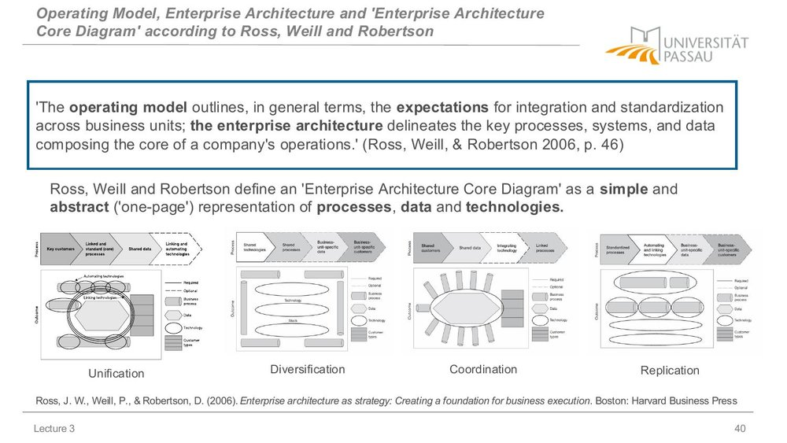

---

### 2.3 Decentralization, Distribution & the Mirroring Hypothesis

**Learning objectives:** distinguish and explain "decentralization" and "distribution" (Vergne 2020); explain the mirroring hypothesis.

**Information (definitions):**
> "Essentially, anything that can be digitized — encoded as a stream of bits — is information." — **Shapiro & Varian 1999, p. 3**
> Information serves to **prepare decisions or actions** (purpose orientation). — **Wittmann 1959, p. 14**

**Herbert Simon (1997):** "…the key problem is how to organize to make decisions — that is, to process information."

**Decentralization vs. Distribution (Vergne 2020, p. 2)** — a favorite distinguish question:
- **Decentralization** = "the dispersion of **coordinated communications** within organizations." → more members can access/process/integrate information; reduces dependence on one central information source.
- **Distribution** = "the dispersion of **organizational decision-making**." → decisions delegated across people/teams/protocols; helps manage complexity and avoid decision paralysis.

> "Decentralization concerns communication and information flow, while distribution concerns who has the authority to make decisions."

**The 2×2 matrix (communication × decision-making):**
| | Coordinated **Centralized** communication | Coordinated **Decentralized** communication |
|---|---|---|
| **Concentrated** decision-making | **Ce-Co** — e.g. junior insurance investigators report claims to one manager who decides | **De-Co** — e.g. ad agency: creatives exchange info/propose a campaign, but the art director decides |
| **Distributed** decision-making | **Ce-Di** — e.g. multidivisional corporation (associates → directors → VPs), decision delegated across hierarchy but communication stays centralized | **De-Di** — e.g. blockchain platforms (Bitcoin, MakerDAO): both communication and decision-making dispersed |

(There's also a more technical 2×2-of-2×2s slide with summary statistics — number of decision-makers, consultation channels, information integrators, channels-per-integrator — for the four ideal types; the * marker means "organizational members take turns to act as decision-makers following a well-defined protocol.")

**The Mirroring Hypothesis (Colfer & Baldwin 2016):**
> "The mirroring hypothesis predicts that organizational ties within a project, firm, or group of firms (e.g., communication, collocation, employment) will correspond to the technical dependencies in the work being performed." (p. 709)

Empirical findings (review of 142 studies): **70%** provide strong evidence supporting mirroring; in **technologically dynamic industries, *partial* mirroring** is more effective and prevalent than strict mirroring.

---

### Module 2 — Practice Open Questions

1. **Distinguish** "integration" and "standardization" as dimensions of an operating model.
2. **Distinguish** the five types of standards according to David 1987.
3. **Explain** advantages and disadvantages of standardization / of integration.
4. **Explain and apply** the four types of Operating Model, using the two guiding questions and a real-company example for each.
5. **Delineate** the four components of an "Enterprise Architecture Core Diagram."
6. **Explain** how the Operating Model relates to the Enterprise Architecture (i.e., why the EA Core Diagram's shape differs across the four Operating Model types).
7. **Distinguish** decentralization from distribution (Vergne 2020).
8. **Apply** the Ce-Co / Ce-Di / De-Co / De-Di matrix to a concrete organizational example.
9. **Explain** the mirroring hypothesis and summarize the empirical evidence for it.

---

## MODULE 3 — Frameworks for IS Architecture Management

### 3.1 Overview of Enterprise Architecture Frameworks

**Learning objectives:** know the Open Group's definition of an "EA Framework"; know and delimit "reference model."

**EA Framework (definition, Open Group):**
> "An architecture framework is a tool which can be used for developing a broad range of different architectures. It should describe a method for designing an information system in terms of a set of building blocks, and for showing how the building blocks fit together. It should contain a set of tools and provide a common vocabulary. It should also include a list of recommended standards and compliant products that can be used to implement the building blocks."

Per **Winter & Fischer 2007**, an EA framework provides:
- One or more **meta-model(s)** for EA description
- One or more **method(s)** for EA design and evolution
- A **common vocabulary**
- **Reference models** usable as templates/blueprints for EA design and evolution

...applicable across a broad range of corporations/government agencies.

**Reference Model (definition)** — satisfies **at least one** of:
- Developed with the intention of being reused for constructing further models, **or**
- Is actually reused for constructing further models.

Important nuance: a model derived from a reference model, and the reference model itself, are at the **same level of abstraction** — i.e., **not** an instantiation relationship (unlike model ↔ meta-model, Module 1.3!).

**Economic effects of using reference models:**
| Dimension | Con | Pro |
|---|---|---|
| **Cost** | Acquisition incurs cost | Saves modeling effort via templates |
| **Time** | Selecting a reference model takes time | Model creation is expedited via reuse |
| **Risk** | Unclear future development of the reference model = "modeling risk" | Established reference models reduce project-failure risk |
| **Competitive position** | Know-how is often generally accessible → also available to competitors | Cost/time/quality/risk advantages strengthen competitive position |

---

### 3.2 The Zachman Framework

**Learning objectives:** explain the Zachman Framework; know/explain the abstractions/issues; delineate the roles.

**Architecture (Zachman's definition, applied to enterprises):**
> "That set of descriptive representations (i.e., 'models') that are relevant for describing an enterprise such that it can be produced to management's requirements (**quality**) and maintained over the period of its useful life (**change**)." — **Zachman 1997, p. 5**

**Critical framing — memorize this distinction:**
> "The Zachman Framework™ **IS NOT a methodology**... The Framework **IS the ontology** for describing the Enterprise. The Framework (ontology) is a **STRUCTURE** whereas a methodology is a **PROCESS**. A Structure is NOT a Process. A Structure establishes **definition** whereas a Process provides **transformation**."

So: Zachman gives you the **classification scheme** for descriptions of the enterprise — not a step-by-step process for building one.

**The grid: 6 columns (abstractions/questions) × 6 rows (roles).**

**Abstractions/Questions (columns):**
| Question | Meaning |
|---|---|
| **What** | What is the product made of? |
| **How** | How does the product work? |
| **Where** | Where are components located relative to each other? |
| **Who** | Who is responsible for which steps? |
| **When** | What happens when? |
| **Why** | Why are decisions made this way and not another? |

**Roles (rows):**
| Row | Role | Description |
|---|---|---|
| 1 | **Scope (Planner)** | Scope Context — the boundary/limit of the Enterprise relative to the columnar abstractions |
| 2 | **Owner** | Business Concepts — Management's perceptions of the design and operation of the enterprise |
| 3 | **Designer** | System Logic — the Designer's/Architect's technology-independent formalism realizing Management's concepts; the **"As Designed"** description |
| 4 | **Builder** | Technology Physics — the Builder's/Engineer's technology-constrained specs to transform System Logic into implementation; the **"As Planned"** description |
| 5 | **Sub-contractor** | Tool Components — implementers'/Technicians' vendor-specific tooling configs to transform "As Planned" into operational reality |
| 6 | **Product** | Operations Instances — the **"As Built"** instantiation; this is the actual enterprise, not an architectural abstraction |

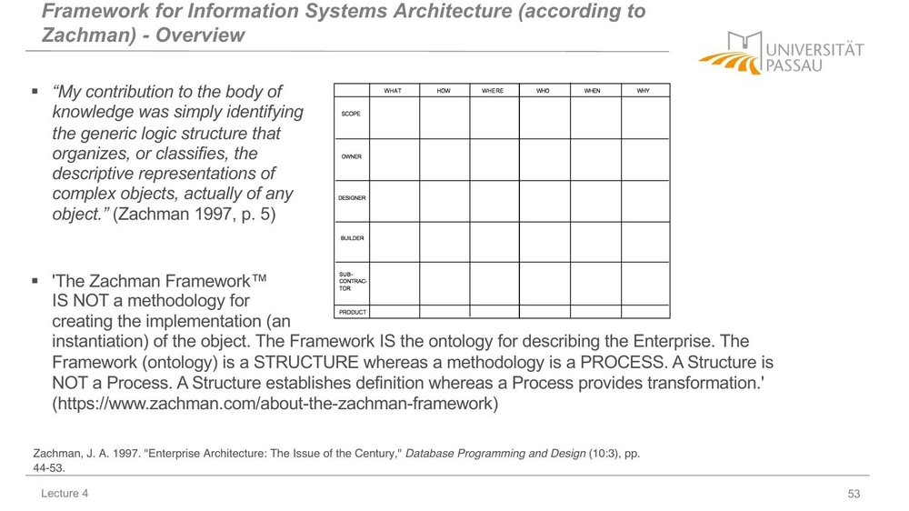

---

### 3.3 TOGAF (The Open Group Architecture Framework)

**Learning objectives:** delineate the four architectural domains; explain TOGAF (the ADM).

**Four Architectural Domains:**
| Domain | Covers |
|---|---|
| **Business Architecture** | Strategy, governance, organizational structure, key business processes |
| **Data Architecture** | Structure of logical & physical data elements of the enterprise |
| **Application Architecture** | The applications needed to execute business processes: their structure, mutual interaction, and relationship to business processes |
| **Technology Architecture** | Infrastructure (hardware & software) providing business, data, and application services |

**Architecture Development Method (ADM)** — a **cyclical** diagram. Structure to memorize:
- **Preliminary** phase feeds into the cycle.
- **Requirements Management** sits at the **center**, bidirectionally connected to *every* phase (requirements feed all phases; every phase can generate new requirements).
- Eight phases arranged clockwise around the circle:
 **A. Architecture Vision → B. Business Architecture → C. Information Systems Architectures (Data + Application) → D. Technology Architecture → E. Opportunities and Solutions → F. Migration Planning → G. Implementation Governance → H. Architecture Change Management** → (loops back to A)

*(Tip: notice that phase C, "Information Systems Architectures," bundles the Data and Application domains together, while phase D isolates the Technology domain — so the 4 TOGAF domains map onto phases B, C, C, D.)*

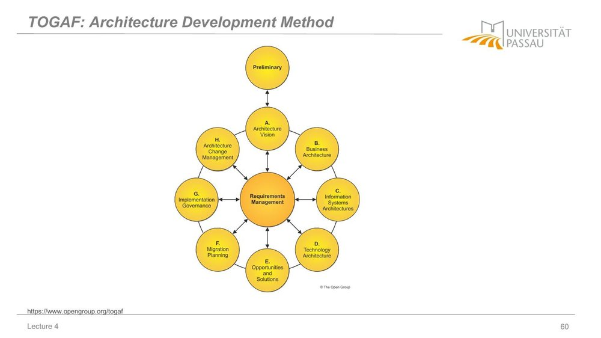

> **Tutorial Q&A — a genuine point of tension, worth having an answer ready for:** *"Should you use Zachman and TOGAF simultaneously, or pick one and stick with it?"* The two frameworks aren't competitors doing the same job: **Zachman is an ontology/classification scheme** (a way of checking that *every* perspective — What/How/Where/Who/When/Why — has been described for *every* stakeholder role), while **TOGAF is a method** (a step-by-step process, the ADM, for actually producing and evolving an architecture). Used *together*, TOGAF supplies the "how do we get there" process while Zachman can serve as a **completeness checklist** to verify nothing has been missed. In practice, however, organizations often deliberately settle on **one** primary framework (usually TOGAF, since it's process-oriented and vendor-supported) to avoid maintaining two parallel governance structures, using ideas from the other only informally. If this exact tension is asked, the safest open-question answer is to **explain both possibilities and justify a choice**: frameworks with different purposes (structure vs. process) *can* be combined without contradiction, but in practice single-framework governance is usually simpler to sustain.

---

### Module 3 — Practice Open Questions

1. **Define** an EA Framework according to the Open Group / Winter & Fischer, and name its four components.
2. **Define and delimit** the term "reference model," distinguishing it from a meta-model.
3. **Explain** the economic effects (cost, time, risk, competitive position) of using reference models.
4. **Explain** why the Zachman Framework is described as an "ontology" rather than a "methodology."
5. **Delineate** the six abstractions/questions of the Zachman Framework.
6. **Delineate** the six roles of the Zachman Framework and their associated description type ("As Designed," "As Planned," "As Built," etc.).
7. **Delineate** the four architectural domains of TOGAF.
8. **Explain** the TOGAF Architecture Development Method, including the role of Requirements Management.

---

## MODULE 4 — Maturity Models & Effects of EA Maturity

*(Note: the slides don't carry an explicit "Module 4" divider, but this content sits between Module 3's frameworks and Module 5's complexity topics — it's the natural fourth block, spanning Lectures 5–7.)*

### 4.1 Maturity Models for Enterprise Architectures

**Learning objectives:** explain the NASCIO maturity model; explain the Ross 2003 model and distinguish it from NASCIO; distinguish/explain the four "stages" of the Ross 2003 model.

> ⚠️ The slide deck lists "NASCIO Maturity Model" as a learning objective but the detailed NASCIO content itself isn't present in these slides — check your separate course notes/reading for the NASCIO stages if the exam explicitly requires it. What follows (Ross 2003) **is** fully covered and is clearly the main model.

**The Architecture Maturity Model — Ross 2003.** Four stages (memorize in order, each builds on the last):
1. **Application Silo Architecture** — architecture consists of architectures of *individual applications*, not the enterprise.
2. **Standardized Technology Architecture** — IT architecture becomes enterprise-wide; efficiencies via **technology standardization** and (often) centralization.
3. **Rationalized Data Architecture** — enterprise-wide architecture expands to include **standardization of data and processes**.
4. **Modular Architecture** — builds on enterprise-wide global standards with **loosely coupled** applications/data/technology components — preserves global standards *while enabling local differences*.

**Resource-allocation view** (the pyramid/wedge chart): as maturity increases, the "Strategic Implications of IT" shift **Local/Functional Optimization → IT Efficiency → Process Optimization → Strategic Choices**, and the composition of investment shifts from Application-layer-heavy (Silo) toward more Infrastructure/Data-layer standardization, with Applications re-emerging (as "Local Customization") at the Modular stage.

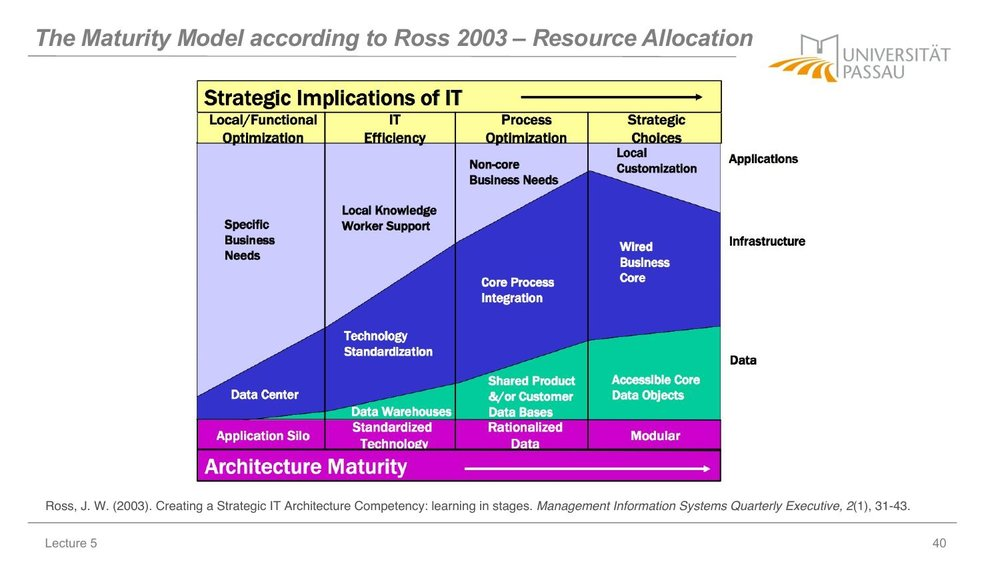

**Characteristics of the Architecture Stages (learn this table — very testable):**
| | Application Silo | Standardized Technology | Rationalized Data | Modular |
|---|---|---|---|---|
| **IT Capability** | Apps serve isolated business needs | Firm-wide technology standards | IT focused on wiring core processes | Modules enable business model extensions |
| **Key Mgmt Innovation** | Technology-enabled change management | Standardization & exception management, refresh | Recognizing the essence of the business | Practices facilitating reusability |
| **Business Case for IT** | ROI of applications | Reduced IT costs, interoperability | Improved business performance, integration | Speed to market, strategic agility |
| **Locus of Control** | Local control | Senior management support of CIO | Senior management, IT, and process leadership | Senior mgmt, IT, process, and local leadership |
| **Key Governance Issues** | Estimate, measure, communicate value | Establish (local/regional/global) standards, exceptions, funding | Determine core processes & funding priorities | Define boundaries for business experiments |

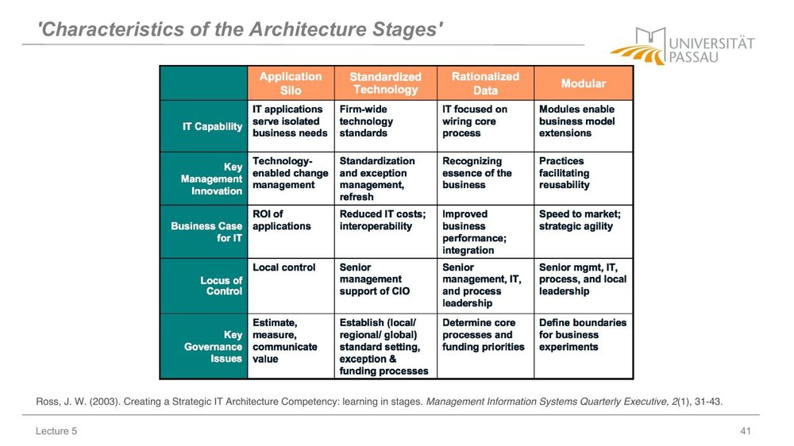

**Key IT Governance & Management Mechanisms** (cumulative as maturity rises):
- **All stages:** business cases, post-implementation reviews.
- **From Standardized Technology on:** executive committee, architecture exception process, centralized infrastructure funding, infrastructure refresh process.
- **From Rationalized Data on:** process owners, project prioritization process, data standardization.
- **From Modular on:** component funding process, component tracking process.

**Advantages and Risks/Challenges of each stage (from Tutorial 6)** — a good source of "pros and cons" open questions:

| Stage | Advantages | Risks / Challenges |
|---|---|---|
| **Application Silo** | High (individual) functional coverage (local optimization); high satisfaction of local managers; good innovation opportunities; easy controllability / little coordination required | Often outdated; difficult to integrate new applications (redundancy); cost-intensive and poor maintainability; complex; slow (time to market) |
| **Standard Technology** | IT efficiency (through cost savings); better maintainability (complexity reduction); higher reliability (complexity reduction); higher security (complexity reduction); easier life for IT architects/developers | Resistance of managers (to fundamentally different solution development); new management processes needed (e.g., replacing a standard); justification of infrastructure investments |
| **Rationalized Data** | Business process efficiency; process optimization; "platform for innovations" | Transferring something wrong into the "core"; problems extracting data from applications; resistance of managers; managers must explain the concept of the "core"; hard to define the "appropriate amount" of change |
| **Modular** | Strategic agility; **"Local Customization"** (innovation + customer responsiveness); autonomy | Companies need to learn *where* agility is necessary; risk of transitioning too early into this stage → "anarchy" |

> **Tutorial Q&A — "What does 'Local Customization' mean at the Modular stage?"** It refers to the fact that, once the enterprise has a standardized, shared **modular core** (standard interfaces, reusable components), individual business units/local teams can safely **customize and innovate on top of that core** — building or adapting the pieces relevant to their local market or customers — *without* breaking the shared standards underneath. This is what drives both **innovation** and better **customer responsiveness** at the local level, while the global core stays consistent. It's the payoff of "loose coupling + standardized interfaces" (compare this directly to Tiwana & Konsynski's modularity definition in Module 6).

---

### 4.2 Effects of Enterprise Architecture Maturity

**Learning objectives:** explain effects of EA maturity on IT costs, strategic business value, flexibility, CIO role; relate the three outsourcing models to maturity levels; explain effects on IT alignment/effectiveness; know constructs of Bradley et al. 2012.

**Cost implications of maturity (pyramid chart):**
- **Shared IT capability** (as % of IT budget) *rises* with maturity: 64% (Silo) → 75% (Standardized) → 84% (Optimized Core) → 85% (Modular).
- **Total IT budget** (relative to Silo=100%) *falls* through the middle stages then *rises* again: 100% → 85% → 75% → **120%** (Modularity costs more overall but delivers far more strategic value — see next point).
- Composition of spend shifts: heavy **Technical Infrastructure** at the Silo/Standardized stages, growing **Enterprise Systems** and re-emerging **Local Applications** at Modularity.

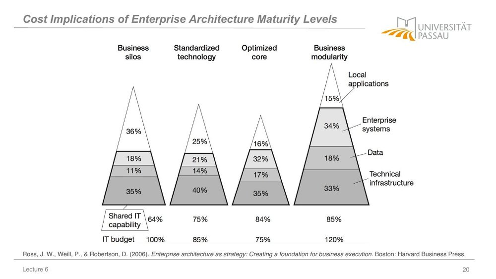

**Strategic Value of IT:** rises along an **S-curve** across the stages — flat/low at "Locally Optimal Business Solutions" (Silos), inflecting upward with "Enterprise-Wide Technology Standards," steepening with "Standardized Enterprise Processes/Data," and reaching highest value with "Standard Interfaces and Business Componentization" (Modularity). Distribution of firms across stages (Ross et al. sample): **25% Silos, 46% Standardized Tech, 27% Optimized Core, 2% Business Modularity.**

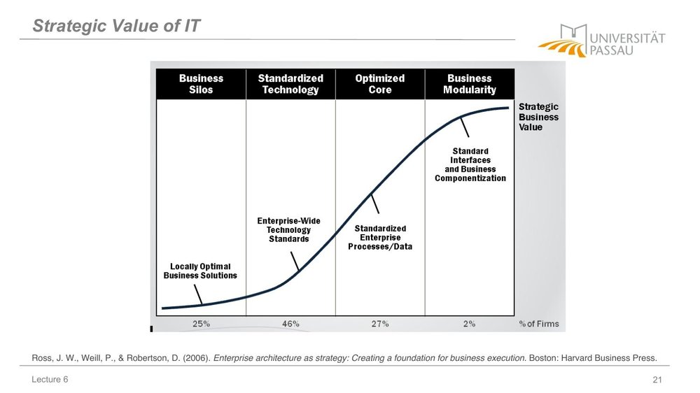

**"Changing from a Local to a Company-wide Perspective":**
> As companies migrate through the stages, they shift from **local optimization to global optimization**. Through stages 2 and 3 especially, companies **trade local flexibility for global flexibility**.

**CIO role evolution:**
| | Business Silos | Standardized Technology | Optimized Core / Business Modularity |
|---|---|---|---|
| **Key CIO skills** | Technical knowledge for standards decisions; implement standard project methodology/oversight; work with top management on basic governance; build the business case for standardization | Detailed knowledge of business functions; manage large org. change; credibility with business/functional heads; manage large central budget; understand architecture as business enabler | Facilitate innovation on new platform; detailed core-business knowledge (could run a BU); delegate ownership of process/data modules while ensuring standards adherence; understand strategic benefits of architecture |
| **Reports to** | CEO or CFO | CEO | CEO |
| **% of IT heads with a 2nd (VP) title** | 0% | 26% | 50% |

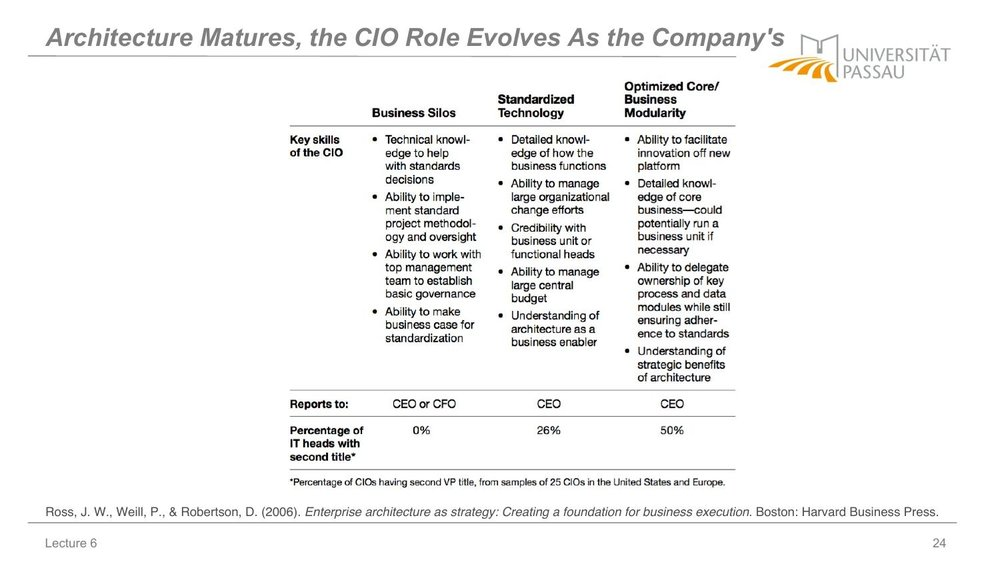

**Three Outsourcing Models (Ross et al. 2006):**
| | Strategic Partnership | Cosourcing | Transaction |
|---|---|---|---|
| **What's outsourced** | Broad responsibility for operational activities | Project management and implementation | Narrowly defined, repeatable process |
| **Key metric** | Bottom-line impact | Project success | Quality and/or cost per transaction |
| **Client-vendor relationship** | Negotiated accountability | Joint project management | Arm's length |
| **Client success rate** | 50% | 63% | 90% |
| **Vendor success rate** | 50% | 75% | 90% |

*(Note: "decreasing risk" runs from Strategic Partnership → Transaction — Transaction outsourcing is lowest-risk/highest-success because it's narrowly scoped.)*

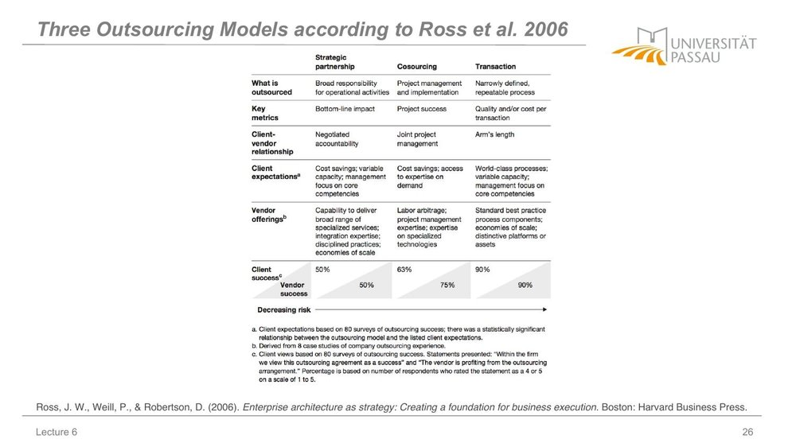

**IT Outsourcing Relationships by Maturity Stage:**
| | Business Silo | Standardized Tech | Optimized Core | Business Modularity |
|---|---|---|---|---|
| **What to outsource** | Easily isolated processes | IT infrastructure management | Project mgmt of major systems implementations | Process design & operation with supporting technology |
| **Ideal relationship** | Narrowly focused transaction outsourcing | Strategic partnership | Cosourcing alliance | Transaction outsourcing |
| **Achievable objectives** | Cost savings | IT mgmt discipline, cost savings, risk reduction, mgmt focus | Tech/expertise transfer, process discipline/reengineering, cost-effectiveness, variable capacity, risk sharing | Strategic agility; leverage IT/process expertise for world-class processes; variable capacity, mgmt focus, cost-effectiveness, risk sharing |

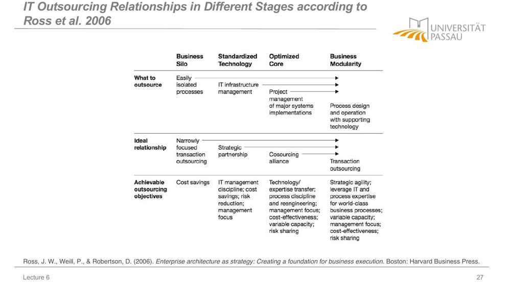

**The Bradley et al. 2012 study (US hospitals)** — ties maturity to IT business value:

*Research Questions:*
1. "To what degree does a hospital's stage of enterprise architecture maturity influence the organizational impact of its IT resources?"
2. "What is the nature of the relationship (e.g., direct or indirect) between a hospital's stage of EA maturity and the organizational impact of its IT resources?"

*Construct definitions (learn verbatim):*
- **IT alignment:** "the degree to which the IT strategies, objectives and priorities support business strategies, objectives and priorities."
- **Operational IT effectiveness:** "focuses on the improvement of business operations."
- **Enterprise agility:** "an organization's ability, as enabled by IT, to sense environmental change and respond readily."

*Alternative alignment definition (Luftman 2004):*
> "Business-IT alignment refers to applying Information Technology (IT) in an appropriate and timely way, in harmony with business strategies, goals and needs... This definition of alignment addresses: How IT is aligned with the business, and how the business should or could be aligned with IT." — i.e., alignment is explicitly **bidirectional**.

*Hypothesis model (Model A, direct model):*
```
                         ┌──► IT Alignment ──────┐
Enterprise Architecture ─┤                        ├──► Enterprise Agility
  Maturity Stage         ├──────── (direct) ──────┤        ▲        ▲
                         └──► Operational IT ─────┘        │        │
                              Effectiveness         Market       External
                                                  Responsiveness  Relationship Mgmt
```
(H1: maturity→alignment; H2: maturity→agility direct; H3: maturity→operational effectiveness; H4: alignment→agility; H5: operational effectiveness→agility; plus market responsiveness and external relationship management as direct drivers of agility, and control variables.)

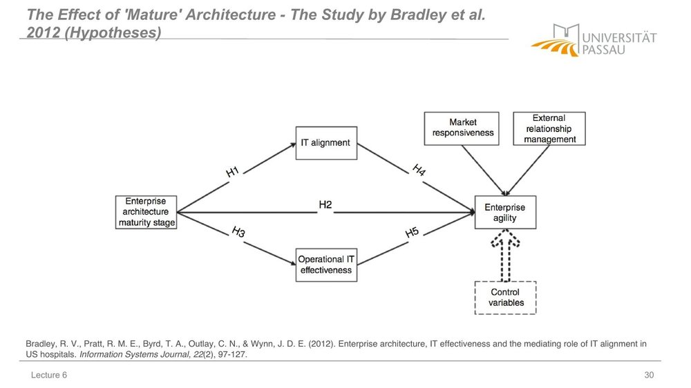

*Results (Model A):* Maturity → IT alignment: **.30**, p<0.01 (significant); Maturity → Enterprise agility (direct): **.26**, p<0.10 (marginal); Maturity → Operational IT effectiveness: **.25**, p<0.05 (significant); IT alignment → agility: **.10** (not significant); Operational IT effectiveness → agility: **.06** (not significant).
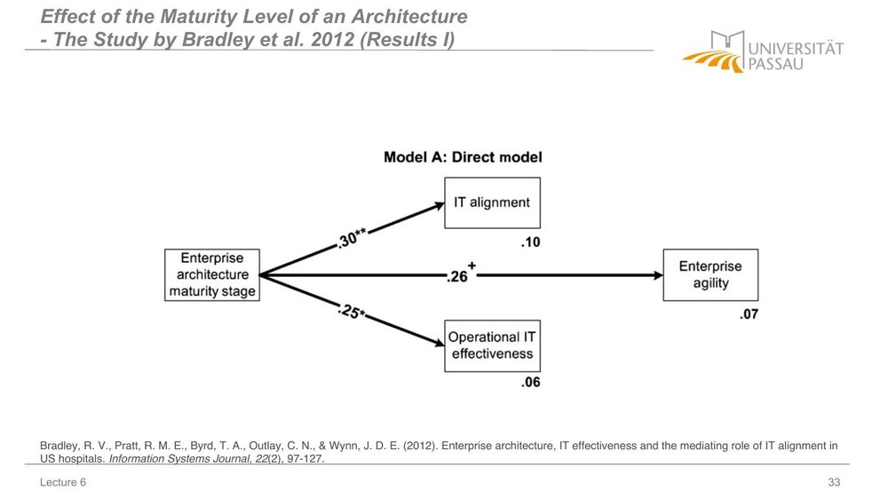

→ **Takeaway for the exam:** EA maturity has clear, significant direct effects on IT alignment and on operational IT effectiveness — but in this direct model, the "downstream" paths from alignment/effectiveness to enterprise agility are weak. This motivates testing **alignment as a mediator** (a more complex model), which is the study's broader contribution — be ready to explain *why* researchers test mediation when direct effects to the final outcome are weak.

*Distribution of maturity levels in the hospital sample:* **Business Silo 15%, Standardized Technology 47%, Optimized Core 34%, Business Modularity 4%.**

---

### Module 4 — Practice Open Questions

1. **Explain and distinguish** the four stages of the Ross 2003 Architecture Maturity Model.
2. **Explain** how IT capability, key management innovation, business case, locus of control, and governance issues change across the four maturity stages.
3. **Explain** the effect of EA maturity on IT costs (shared IT capability vs. total IT budget).
4. **Explain** the effect of EA maturity on the strategic value of IT.
5. **Explain** how the CIO role evolves as architecture matures.
6. **Relate** the three outsourcing models (Strategic Partnership, Cosourcing, Transaction) to architecture maturity stages.
7. **Explain** the constructs used in the Bradley et al. 2012 study (IT alignment, operational IT effectiveness, enterprise agility) and how they relate to EA maturity.
8. **Explain** why the direct effects of IT alignment/operational effectiveness on enterprise agility were not significant in Model A, and what this implies methodologically.

---

## MODULE 5 — Management of IT Complexity

### 5.1 Fundamentals of Complexity

**Learning objectives:** distinguish the "network-in-use" perspective from the static perspective; explain "Complex Adaptive System"; explain "emergence."

**Business Model (context-setter):**
> "A business model describes the rationale of how an organization creates, delivers, and captures value." — **Osterwalder & Pigneur 2010, p. 14**

**Complex systems (Amaral & Uzzi 2007):** In contrast to *simple* systems (few well-understood components, e.g. a pendulum) and *complicated* systems (many components interacting via **predefined** coordination rules, e.g. a Boeing jet), **complex systems** have many components that interact **autonomously** through **emergent** rules. In management contexts, complex systems arise wherever there are populations of interacting agents (people, organizations, communities) acting on **limited, local information**, trading resources **without central control**, such that no one fully understands how distant agents' actions affect them.

**"Network-in-use" perspective (Merali 2006):** Complexity of an information system's network arises from **variable connectivity over time** *and* **multiple versions of information** transmitted through the network — i.e., complexity is about the *dynamic, in-use* behavior of the network, not just its static topology. This is the key contrast with the "static" architecture-diagram view of an IS.

**Complex Adaptive Systems (CAS) — Holland:**
> "CAS are systems that have a large number of components, often called **agents**, that interact and adapt or learn."

**Four properties of CAS (Holland) — a classic explain/delineate question:**
1. **Parallelism:** large numbers of agents interact by sending/receiving signals **simultaneously**, producing many simultaneous signals.
2. **Conditional action:** agents follow an **IF/THEN** structure — IF [signal x present] THEN [execute act y].
3. **Modularity:** groups of rules combine into "subroutines" — reusable building blocks combinable for novel situations, rather than anticipating every situation with a distinct rule.
4. **Adaptation and evolution:** agents change over time via *performance-improving* adaptation (not random variation), which requires solving two problems:
   - **Credit assignment problem:** performance feedback (payoff/reward) is often irregular and partial — hard to identify which past "stage-setting" choices caused later improvements.
   - **Rule discovery problem:** replacing ineffective rules can't just be random — that's like inserting random instructions into a program.

**Emergence:**
> "Emergence refers to the phenomenon whereby the macroscopic properties of the system arise from the microscopic properties (interactions, relationships, structures, and behaviours) and heterogeneity of its constituents. The emergent macroscopic 'whole' displays a set of properties that is distinct from those displayed by any subset of its individual constituents and their interactions." — **Merali 2006, p. 220**

In short: **the whole is qualitatively different from any subset of its parts.** Example used in the slides: **Conway's Game of Life** — simple local rules produce complex, unpredictable global patterns (a visual/behavioral illustration of emergence).

---

### 5.2 Complexity of IT Architectures

**Learning objectives:** explain the multidimensional conceptualization of IT-architecture complexity; distinguish "IT complexity" from "IT heterogeneity."

Managing IT-architecture complexity is a core problem across multiple research streams: **IT Standardization** (Boh & Yellin 2006; Weitzel et al. 2006), **Vendor Management** (Lacity & Willcocks 1998; Rottman & Lacity 2006), and **Enterprise Architecture Management** (Richardson et al. 1990; Ross et al. 2006; Tamm et al. 2011).

**Computing Complexity (definition):**
> "Computing complexity can be characterized by the number and the variety of components and their interactions... the rate of system change in time and space is an additional factor." — **Schneeberger & McLean 2003**

Visualized as a "complexity cross": **Components** (Number × Variety) and **Interactions** (Number × Variety), with **Rate of change** as a cross-cutting additional factor.

**Multidimensional conceptualization of IT-architecture complexity:**
IT architecture = **Data Architecture** + **Application Architecture** + **Infrastructure Architecture** (Ross 2003). For each:
- **Number of Components**
- **Number of Relations**
- **Heterogeneity of Components**
- **Heterogeneity of Relations**

Plus two additional cross-cutting factors: **Dynamics** (rate of change) and **Modularity**.

→ **IT complexity is the broader, multidimensional umbrella term; IT heterogeneity is specifically about the *distribution* of attribute values (see 5.3) — heterogeneity is one dimension *within* complexity, not a synonym for it.**

---

### 5.3 Measurement of IT Heterogeneity

**Learning objectives:** know/apply HHI and EM as heterogeneity measures; distinguish "IT complexity" from "IT heterogeneity."

**Heterogeneity (definition):** a **statistical property** referring to the **distribution of attribute values** (of components and relations) in an IT landscape. Example: an application (component) has a *provider* (attribute) such as IBM (attribute value); heterogeneity describes how applications' providers are distributed.

**Herfindahl-Hirschmann Index (HHI)** — used e.g. by the U.S. DOJ/FTC:
$$HHI = \sum_i f_i^2$$
where *f_i* = relative market share of provider *i*.
- HHI **increases** as the number of attribute values (providers) **decreases** and as the **inequality** of the distribution increases.
- Range: **1/n** (perfectly equal distribution) to **1** (monopoly).

**Entropy Measure (EM):**
$$EM = -\sum_i f_i \ln f_i \quad \text{(informally: increases with more, more-equal shares)}$$
- EM **increases** with the number of attribute values and with **equality** of the distribution.
- Range: **0** (monopoly) to **ln(n)** (n equally-sized shares).

*Worked comparison from the slides:* a 4-provider skewed distribution can have **HHI = 0.33** while a different 4-provider distribution has **HHI = 0.36** (more concentrated). Separately, a 4-provider distribution and a perfectly even 2-provider distribution can both show **EM = 0.70** — illustrating that **EM alone doesn't tell you *n*** (a given entropy value can arise from different numbers of attribute values combined with different degrees of equality) — this is exactly the kind of nuance an "apply/calculate" exam question would test.

**Trade-offs in the "optimal" degree of multi-sourcing (provider heterogeneity):**
| High multi-sourcing | Low multi-sourcing |
|---|---|
| Increases competition among providers (Lacity & Willcocks 1998) | "High quality" customer-provider relationships (Bakos & Brynjolfsson 1993) |
| Reduces strategic risk / dependency on one provider (Rottman & Lacity 2006; Cousins & Spekman 2003) | Reduces coordination effort (Cousins & Spekman 2003) |
| Useful when the provider market changes rapidly (Levina & Su 2008) | |

**Decision rules for managing IT complexity/heterogeneity** — when facing a high degree of IT complexity, ask:
1. **Is there a "business case" for the observed level of complexity?** (Element-, relation-, and attribute-specific cost-benefit trade-offs; some business strategies justify high complexity.)
2. **Is the high system-level complexity caused by low-complexity subsystems?** (A structure heterogeneous at system level may consist of homogeneous subsystems — an aggregation effect.)

---

### 5.4 Ashby's Law of Requisite Variety

**Learning objectives:** explain Ashby's Law of Requisite Variety; explain its fundamental context.

**Context:** **W. Ross Ashby**, 1957, in **cybernetics** — the science of control of machines, organisms, and organizations. The law addresses the extent to which one system can **control** another.

**Variety** = the different ways in which a system can act and communicate.

**The Law:** the more variety (possibilities) a system has for control/regulation, the more disturbances it can compensate for.

**Diagram:** `System 1 —controls→ System 2`

**Implication:** for successful control of a complex system, **System 1 must have at least as much variety for control/regulation as can occur in System 2.** (I.e., the controller's variety must match or exceed the controlled system's variety — directly relevant to why *managing* IT complexity/heterogeneity requires sufficiently rich governance mechanisms.)

---

### 5.5 Effect of Enterprise Architecture Standards — Boh & Yellin 2006

**Research questions:**
1. How do different **governance mechanisms** affect the use of EA standards?
2. To what extent does the use of EA standards achieve the objectives of improving **sharing and integration** of IT resources across the enterprise?

**EA Standards (definition):**
> "EA standards specify the logical organization of corporate IT infrastructure, enterprise data and information, and applications that support core business processes... Well-stated standards should guide the enterprise to choose technology alternatives consistent with the business direction... EA standards can be documented in many ways, including plain text, pictures, diagrams, and engineering blueprints." — **Boh & Yellin 2006, p. 165**

**Four categories of EA standards:**
1. **Physical IT infrastructure management** — standardizes underlying tech: computers, networks, routers, servers, peripherals, OS, DBMS, middleware.
2. **Human IT infrastructure management** — manages human IT resources: skills, expertise, competencies, knowledge.
3. **Integrating business applications** — strategic direction for managing the applications portfolio and integration technologies.
4. **Enterprise data integration** — highlights critical data elements/databases to integrate, defining focus data elements.

**Research model (governance mechanisms → EA standards use → outcomes):**
| Governance mechanism (H1a–d) | → EA standards category | → Outcome (H2a–d) |
|---|---|---|
| Define key architecture roles (EA mgmt team, chief architect, architecture teams, key stakeholders) | → EA standards for **physical IT infrastructure** | → Reduce heterogeneity of physical IT infrastructure |
| Institutionalize mechanisms to involve stakeholders (direct communication, liaison roles) | → EA standards for **human IT infrastructure** | → Reduce replication of IT infrastructure services |
| Institutionalize processes for monitoring EA standards (external-standard-based setting; conformance/exception handling) | → EA standards for **integrating business applications** | → Business applications integration |
| Centralize IT decision-making (infrastructure management; applications development/planning) | → EA standards for **enterprise data integration** | → Enterprise data integration |

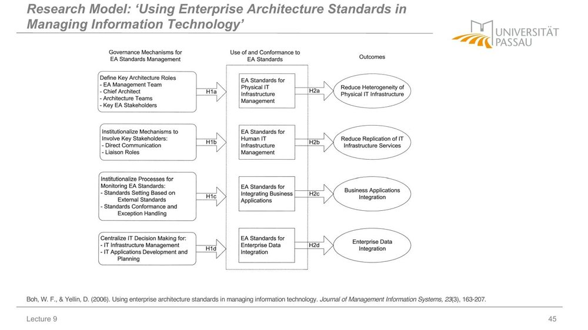

**Results (path coefficients, illustrative of magnitude/significance):** governance mechanisms → standards-use paths were mostly significant and positive (~0.23–0.45). Standards-use → outcome paths: standards use **reduced** heterogeneity of physical IT infrastructure (**−0.37**) and **reduced** replication of IT infrastructure services (**−0.36/−0.37**) — negative because more standards use *lowers* heterogeneity/replication — while standards use *increased* business applications integration (**+0.34**) and enterprise data integration (**+0.28**).

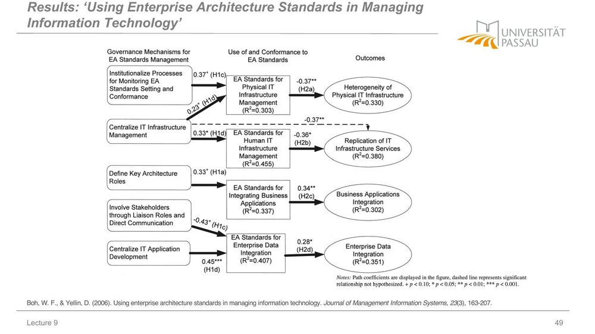

→ **Takeaway:** governance mechanisms that centralize/institutionalize EA-standards management **do** translate into greater standards use, and greater standards use **does** deliver the intended outcomes (less unwanted heterogeneity/replication, more integration).

---

### 5.6 Functional Redundancy & Consolidation

**Functional Redundancy (definition):** more than one component fulfills the same function.
> Application **A** is functionally redundant to application **B** if A provides the **same output information** as B for **all** input information. (This relation is **non-commutative** but **transitive**.)

**(Application) Consolidation (definition):** merging two functionally redundant applications, aiming to **discontinue** one of them.

**Problem framing:**
- **Planned** redundancy (deliberate, e.g. for resilience) vs. **"unnecessary"** redundancy.
- Unnecessary functional redundancy is a **major driver of operating costs**.
- **Complete elimination** of redundancy is neither reasonable nor possible.
- Central question: **"What should be the cost-optimal level of unnecessary redundancy in a target architecture?"**

**Example (cross-company IT landscape):** Two companies each have their own Customer Contact, Credit Assessment, and Posting applications. In the *current state*, Company 1's and Company 2's Customer-Contact apps (A, A′) are functionally redundant to each other, as are the Credit-Assessment apps (B, B′). Two possible future states show different **consolidation** choices — e.g., merging the redundant Customer-Contact apps into one shared app used by both companies, or merging at the Credit-Assessment layer instead — each option changing which applications communicate with which.

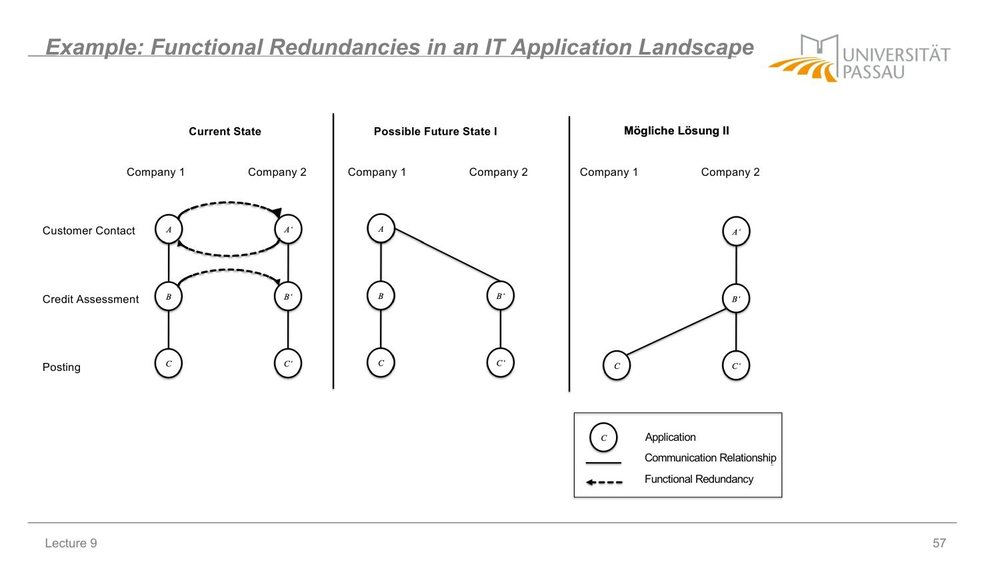

**IT Redundancy — the fundamental trade-off:**
| **Cost of Redundancy** (keeping duplicates) | **Cost of Redundancy Reduction** (consolidating) |
|---|---|
| Operating costs (ongoing) for unnecessary IT applications | Consolidation costs (one-time) |
| Communication costs (ongoing) for unnecessary interfaces | Development costs (one-time) + communication costs (ongoing) for new interfaces |

---

### Module 5 — Practice Open Questions

1. **Distinguish** the "network-in-use" perspective on an information system from the static perspective.
2. **Explain** the term "Complex Adaptive System" and its four properties according to Holland.
3. **Explain** the "credit assignment problem" and the "rule discovery problem."
4. **Explain** the term "emergence," with an example.
5. **Explain** the multidimensional conceptualization of IT-architecture complexity, and **distinguish** IT complexity from IT heterogeneity.
6. **Explain and apply** the Herfindahl-Hirschmann Index and the Entropy Measure as measures of IT heterogeneity (be ready to compute/compare simple examples).
7. **Explain** the trade-offs of high vs. low multi-sourcing (provider heterogeneity).
8. **Explain** the two decision rules proposed for managing high IT complexity.
9. **Explain** Ashby's Law of Requisite Variety and the cybernetics context it comes from.
10. **Explain** the four categories of EA standards according to Boh & Yellin 2006, and how governance mechanisms relate to their use and outcomes.
11. **Define** functional redundancy and (application) consolidation.
12. **Explain** the fundamental cost trade-off involved in managing IT redundancy.

---

## MODULE 6 — Modularity of IT Architectures, Bi-Modal IT & Digital Platforms

*(Lectures 10–11. Like Module 4, there's no explicit "Module 6" divider slide in the deck, but this content is introduced with its own outline slide — "Modularity of IT Architectures" — sitting right after Functional Redundancy & Consolidation, so it functions as the sixth module.)*

**Learning objectives (from the outline slide):** explain the concept of modularity of IT architectures; know and apply the results of Tiwana & Konsynski's (2010) model; define bi-modal architectures; explain and differentiate "Heavyweight IT" and "Lightweight IT"; place bi-modal architectures in the Ross 2003 maturity model.

### 6.1 The Power of Modularity

> "(IT) systems are often 'nearly decomposable.'" — **Simon 1991**
> "Modularity offers simplicity in dealing with a complex system." — **Yoo 2013, p. 228**

Modularity's core promised benefit: **increased flexibility ("mix and match")** — you can recombine modules rather than rebuild the whole system.

**Four design parameters of modularization — Ethiraj & Levinthal 2004** (a clean "delineate" question):
1. The **"appropriate" number of modules**
2. The **"appropriate" mapping** of design elements to modules
3. The **"appropriate" interactions among design elements *within* each module**
4. The **"appropriate" interfaces/interactions *between* modules**

(Notice the word "appropriate" is doing all the work in each parameter — modularization isn't just "cut the system into pieces," it's *deliberately choosing* the right granularity, grouping, internal cohesion, and external interfaces. This is the more technical, design-theory counterpart to the Module 2 discussion of standardization/integration and to the Module 4 "Modular Architecture" stage.)

---

### 6.2 Complementarities Between Organizational IT Architecture and Governance Structure — Tiwana & Konsynski 2010

**Research question:**
> "How do organizational IT architecture modularity and IT governance structure — independently and jointly — influence IT alignment?"

**IT architecture modularity (definition):**
> "We … define IT architecture modularity as the **degree of decomposition** of an organization's IT portfolio into **loosely coupled subsystems** that communicate through **standardized interfaces**." — **Tiwana & Konsynski 2010, p. 290**

Two sub-dimensions (both continua, *not* binary properties):
- **Loose coupling:** "the degree to which the applications in an organization's IT architecture are designed such that internal changes in one application do not affect the behavior of others." (p. 290)
- **Standardization:** "the degree to which organization-wide standards and policies prespecify how applications in an organization's IT portfolio connect and interoperate with each other." (p. 290)

**IT governance decentralization (definition):** also a continuum, built from two sub-dimensions:
- **IT specification decision rights:** decision-making authority for specifying **what** objectives IT should accomplish.
- **IT implementation decision rights:** decision-making authority for specifying **how** IT should accomplish those objectives.

**The model (memorize the causal chain):**
```
IT architecture modularity ──────────────► IT agility ──────────────► IT alignment
 (Loose coupling + Standardization)             ▲                          ▲
                                                 │                          │
IT governance decentralization ─────────────────┘                Control variables
 (IT specification decentralization +                        (IT-line interunit ties, IT unit's
  IT implementation decentralization)                     business knowledge, line functions' technical
                                                          knowledge, requirements codifiability, CIO on
                                                          board, IT unit age, IT investment intensity, firm size)
```
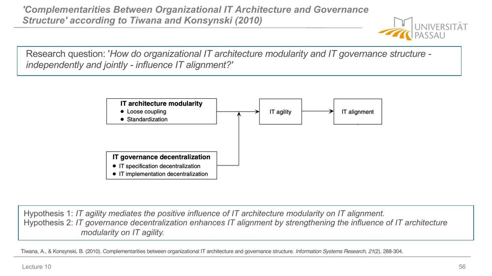

IT governance decentralization has its own direct arrow into the model **and** an arrow feeding into the *modularity → agility* relationship — i.e., it's modeled as a **moderator** of that link, not just another independent driver.

**Hypotheses:**
- **H1:** *IT agility mediates the positive influence of IT architecture modularity on IT alignment.*
- **H2:** *IT governance decentralization enhances IT alignment by strengthening the influence of IT architecture modularity on IT agility* (i.e., decentralization is a **moderator**).

**Results (N = 223 organizations; β with T-statistics):**
- Loose coupling → IT architecture modularity: **0.50**, p<0.01; Standardization → IT architecture modularity: **0.69**, p<0.001 (both strong, confirming modularity is well captured by these two sub-dimensions).
- **IT architecture modularity → IT agility: 0.40, p<0.001** (R² of IT agility = 29.2%).
- **IT agility → IT alignment: 0.38, p<0.001** (R² of IT alignment = 57.3%).
- IT specification decentralization → IT governance decentralization: **0.42*, p<0.05**; IT implementation decentralization → IT governance decentralization: **0.91***, p<0.001** (implementation rights dominate the decentralization construct).
- **The moderation effect of IT governance decentralization on the modularity→agility path is positive and significant (0.17, p<0.01)** — supporting **H2**: more decentralized IT governance *strengthens* the link between architecture modularity and IT agility.
- A small but significant **direct** path from IT architecture modularity to IT alignment (bypassing agility) was also found — consistent with **H1** describing *partial* (not complete) mediation through IT agility.
- Among control variables, **IT-line interunit ties** and **IT unit's business knowledge** had significant positive effects on IT alignment; other controls (line functions' technical knowledge, requirements codifiability, CIO on board, IT unit age, IT investment intensity, firm size) were not significant.
- **Takeaway for the exam:** both H1 and H2 were supported — IT architecture modularity boosts IT alignment mainly *through* increased IT agility, and this effect is *amplified* when IT governance is more decentralized (specification and especially implementation decisions pushed down/out to business units).

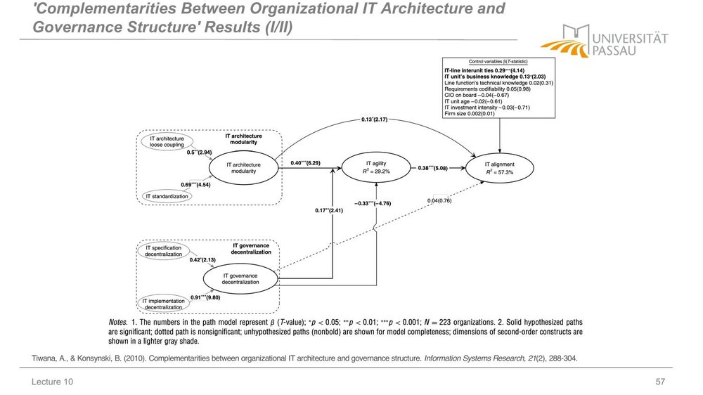

---

### 6.3 Bi-Modal IT — "IT of the Two Speeds"

**The core idea:** a single, tightly-integrated ("spaghetti") architecture that tries to deliver both **IT efficiency** and **IT flexibility** at once is split into **two separate modes**:
- **"Connect & Coordinate"** → optimized for **IT flexibility**, closer to the customer-facing side.
- **"Command & Control"** → optimized for **IT efficiency**, closer to the infrastructure side.

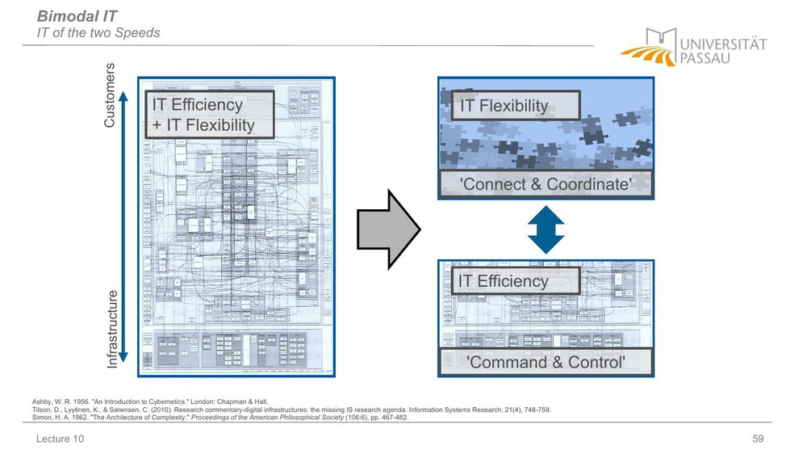

This split is explicitly framed as an application of **Ashby's Law of Requisite Variety** (Module 5.4) and of **Simon's (1962) "Architecture of Complexity"** — decomposing one overly complex system into two more tractable, differently-governed sub-systems, each matched to the kind of variety/disturbance it needs to handle. (See **Tilson, Lyytinen & Sørensen 2010** on digital infrastructures.)

**Bi-Modal IT: Boon or Bane? — a genuine debate, good material for a "discuss both sides" question:**
- **Pro (McKinsey, "Organizing for digital acceleration"):** adopting a two-speed IT operating model lets companies get more from their IT architectures and deliver innovative online customer experiences faster.
- **Con (Forrester, "The False Promise of Bimodal IT"):** bimodal IT is only an incremental change to the status quo and doesn't address the deeper business/process/organizational changes needed; it creates two segregated groups competing for funding, resources, skills, and business attention, and is fundamentally unable to address the need for a single, connected customer/enterprise strategy. Forrester argues for a bolder, unified "Business Technology" strategy instead of a two-speed split.

**Heavyweight IT vs. Lightweight IT — Bygstad 2017 (a core "explain and differentiate" table):**

| | **Heavyweight IT** | **Lightweight IT** |
|---|---|---|
| Knowledge regime | Driven by **IT professionals**, enabled by systematic specification and proven digital technology, realized through **software engineering** | Driven by **competent users'** need for solutions, enabled by the **consumerization** of digital technology, realized through **innovation processes** |
| Profile | Back-end: supporting documentation of work | Front-end: supporting work processes |
| Owner | IT department | Users and vendors |
| Systems | Transaction systems | Process support, apps, BI |
| Technology | PCs, servers, databases, integration technology | Tablets, electronic whiteboards, mobile phones |
| IT architecture | Fully integrated solutions, centralized or distributed | Non-invasive solutions, frequently meshworks (heterogeneous networks) |
| Development culture | Systematics, quality, security | Innovation, experimentation |
| Problems | Increasing complexity, rising costs | Isolated gadgets, security |
| Discourse | Software engineering | Business and practice innovation |

**Placing Bi-Modal IT in the Ross 2003 maturity model:** Heavyweight IT maps naturally onto the **Standardized Technology / Rationalized Data** stages (centralized, standards-driven, back-end focus), while Lightweight IT echoes the **Modular** stage's promise of local flexibility and "local customization" on top of a standardized core — i.e., bi-modal IT is essentially one concrete organizational *implementation* of the trade-off the Ross model describes between company-wide standardization and local/business-unit agility. Be ready to make this connection explicitly if asked to "place bi-modal architectures in the Ross 2003 maturity model."

---

### 6.4 IT Architectures and Digital Platforms

**Three types of digital platforms — Cusmano, Yoffie & Gawer 2020, p. 28:**
- **Transaction platforms:** "intermediaries or online marketplaces that make it possible for participants to exchange goods and services or information… these platforms create value by enabling exchanges that would not otherwise occur without the platform as an intermediary."
- **Innovation platforms:** "facilitate the development of new, complementary products and services, such as PC or smartphone apps, that are built mostly by third-party companies without traditional supplier contracts."
- **Hybrid platforms:** "contain both innovation and transaction platforms."

**Product Model vs. Innovation Platform Model (Tiwana 2013)** — a structural shift:
- **Product model:** individual firms each build a complete, standalone **Product 1, 2, 3, 4…**, with no shared layer between them.
- **Platform model:** each firm's product is split into **Unique Components** (owned/built by the individual firm) sitting on top of a shared **Platform layer of "Duplicated Components"** (owned by the platform owner, reused across all firms' products).
→ This is the platform-economics analogue of "modularity": the platform *is* the standardized, shared module; each firm's unique components are the customizable, loosely-coupled layer on top — directly parallel to the Ross "Modular Architecture" stage and to Tiwana & Konsynski's loose-coupling + standardization definition.

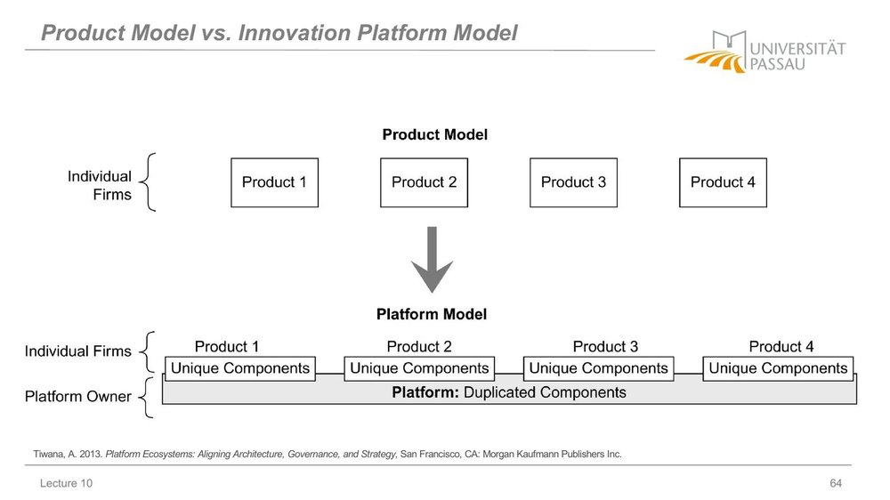

**The Layered Architecture of Digital Technology — Yoo, Henfridsson & Lyytinen 2010, Fig. 1, p. 727.** Four layers, bottom to top:
1. **Device Layer** — split into *Physical machinery* and *Logical capability*
2. **Network Layer** — split into *Physical transport* and *Logical transmission*
3. **Service Layer**
4. **Contents Layer**

(Notice the recurring pattern: the two lowest layers are each internally split into a "physical" and a "logical" sub-layer — this separation of physical infrastructure from logical/software capability is itself what enables modular recombination and platform-style innovation on top of shared infrastructure.)

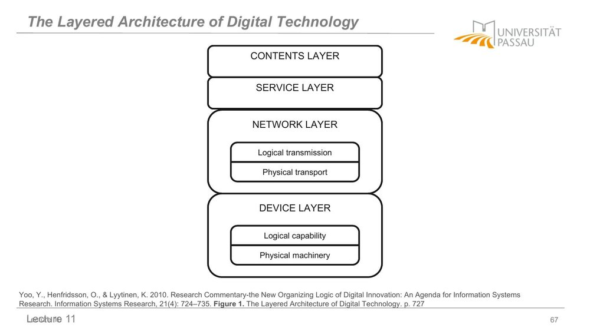

---

### Module 6 — Practice Open Questions

1. **Explain** the concept of modularity of IT architectures, and delineate the four design parameters of modularization according to Ethiraj & Levinthal 2004.
2. **Define** IT architecture modularity according to Tiwana & Konsynski 2010, and distinguish its two sub-dimensions (loose coupling, standardization).
3. **Distinguish** IT specification decision rights from IT implementation decision rights.
4. **Explain and apply** the results of Tiwana & Konsynski's (2010) model — in particular, explain how IT governance decentralization affects the relationship between IT architecture modularity and IT alignment.
5. **Define** bi-modal architectures ("IT of the two speeds"), and explain the theoretical justification for splitting IT into two modes (referring to Ashby's Law and/or Simon's Architecture of Complexity).
6. **Explain and differentiate** "Heavyweight IT" and "Lightweight IT" according to Bygstad 2017.
7. **Discuss** the "Boon or Bane?" debate around bimodal IT — summarize both the pro (McKinsey) and con (Forrester) positions.
8. **Place** bi-modal architectures within the Ross 2003 maturity model — which stage(s) does each "mode" most resemble, and why?
9. **Distinguish** transaction platforms, innovation platforms, and hybrid platforms according to Cusmano, Yoffie & Gawer 2020.
10. **Explain** the shift from the Product Model to the Innovation Platform Model (Tiwana 2013), and relate it to the concept of modularity.
11. **Delineate** the four layers of the Layered Architecture of Digital Technology (Yoo, Henfridsson & Lyytinen 2010).

---

## Master Citation Quick-Reference

| Author(s) & Year | Concept |
|---|---|
| IEEE 2000 | General definition of "architecture" |
| Ross 2003 | IT Architecture definition; 4-stage Architecture Maturity Model |
| König 1994 | Information System definition (socio-technical) |
| Suchan & Frank 2012 | IS as sub-system of enterprise (task object/carrier/phase matrix); IS/IT architectures as models |
| Tamm, Seddon, Shanks & Reynolds 2011 | Enterprise Architecture Benefits Model (EABM) |
| Ferstl & Sinz 2013 | Meta-model definition |
| Ross, Weill & Robertson 2006 | Operating Model definition; 4 Operating Model types; EA Core Diagram; CIO role evolution; outsourcing models; cost/strategic-value implications of maturity |
| David 1987 | Types of standards |
| Laudon et al. 2015 / Rosemann 1996 | Integration definitions (connecting vs. unifying) |
| Vergne 2020 | Decentralization vs. distribution; Ce-Co/Ce-Di/De-Co/De-Di matrix |
| Shapiro & Varian 1999 / Wittmann 1959 | Definitions of "information" |
| Colfer & Baldwin 2016 | Mirroring hypothesis |
| Open Group / Winter & Fischer 2007 | EA Framework definition |
| Zachman 1997 | Zachman Framework (ontology, 6×6 grid) |
| Bradley et al. 2012 | EA maturity → IT alignment/effectiveness → enterprise agility (US hospitals study) |
| Luftman 2004 | Alternative (bidirectional) IT-business alignment definition |
| Osterwalder & Pigneur 2010 | Business model definition |
| Amaral & Uzzi 2007 | Complex systems (vs. simple/complicated systems) |
| Merali 2006 | Network-in-use perspective; emergence |
| Holland 2006 | Complex Adaptive Systems; 4 CAS properties |
| Schneeberger & McLean 2003 | Computing complexity definition ("complexity cross") |
| Widjaja, Kaiser, Tepel & Buxmann 2012 | IT heterogeneity as statistical property; HHI/EM application; decision rules for managing complexity |
| Ashby 1957 | Law of Requisite Variety (cybernetics) |
| Boh & Yellin 2006 | EA standards: 4 categories; governance-mechanisms research model |
| Bakos & Brynjolfsson 1993 / Cousins & Spekman 2003 / Lacity & Willcocks 1998 / Rottman & Lacity 2006 / Levina & Su 2008 | Multi-sourcing trade-offs |
| Simon 1991 / Simon 1962 | "Nearly decomposable" systems; "The Architecture of Complexity" (theoretical basis for splitting complex systems, incl. bimodal IT) |
| Yoo 2013 | Modularity offers simplicity in dealing with a complex system |
| Ethiraj & Levinthal 2004 | Four design parameters of modularization |
| Tiwana & Konsynski 2010 | IT architecture modularity (loose coupling + standardization); IT governance decentralization; mediated-moderation model of IT alignment |
| Ashby 1956 | "An Introduction to Cybernetics" — cited again as the basis for splitting IT into two modes (bimodal IT) |
| Tilson, Lyytinen & Sørensen 2010 | Digital infrastructures; "IT of the two speeds" framing |
| Bygstad 2017 | Heavyweight IT vs. Lightweight IT |
| Cusmano, Yoffie & Gawer 2020 | Three types of digital platforms (transaction, innovation, hybrid) |
| Tiwana 2013 | Platform Ecosystems — Product Model vs. Platform Model |
| Yoo, Henfridsson & Lyytinen 2010 | Layered Architecture of Digital Technology (device/network/service/contents layers) |

---

## Final Integrated Practice Set (mixed modules — mimics a real open-question exam)

1. Compare the EABM (Tamm et al. 2011) and the Operating-Model/EA-Core-Diagram approach (Ross, Weill & Robertson 2006): both link "architecture" to "benefits/execution" — what does each model emphasize that the other doesn't?
2. A company you're advising has application silos and wants to move toward a Modular architecture. Using the Ross 2003 stage model, explain what changes in IT capability, governance, and CIO role you would expect at each intermediate stage.
3. Explain how Ashby's Law of Requisite Variety helps justify *why* firms need formal EA standards (Boh & Yellin 2006) as IT landscapes grow more heterogeneous.
4. A firm's IT landscape shows a low HHI but is still described by managers as "too complex." Using the multidimensional conceptualization of IT-architecture complexity, explain why heterogeneity (as measured by HHI) is not the same thing as complexity.
5. Using the Zachman Framework and TOGAF side by side, explain the difference between an "ontology" (structure) and a "method" (process) for enterprise architecture — and where each framework sits.
6. Explain how "decentralization" and "distribution" (Vergne 2020) relate to the four Operating Model types (Diversification, Coordination, Replication, Unification) — which combinations would you intuitively expect to pair together, and why?
7. Using the Bradley et al. 2012 results, explain why a researcher might conclude that IT alignment is better modeled as a **mediator** rather than only as a parallel direct predictor of enterprise agility.
8. Explain the relationship between functional redundancy, consolidation, and the concept of "IT heterogeneity" — could reducing redundancy ever *increase* measured heterogeneity, or vice versa? Justify your answer.
9. Compare Tiwana & Konsynski's (2010) definition of "IT architecture modularity" (loose coupling + standardization) with Ross's (2003) description of the "Modular Architecture" stage — are these the same concept described differently, or genuinely different constructs? Justify your answer.
10. A CIO proposes splitting the company's IT into a "Heavyweight" back-end and a "Lightweight" front-end (bimodal IT). Using both the McKinsey and Forrester positions, and Ashby's Law of Requisite Variety, argue for *and* against this proposal.

---

*Good luck — Viel Erfolg bei der Prüfung!*
